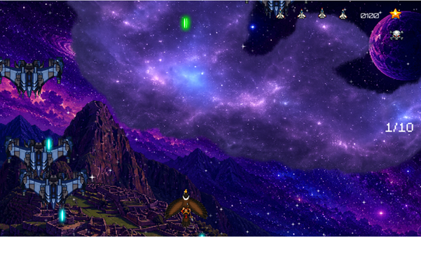
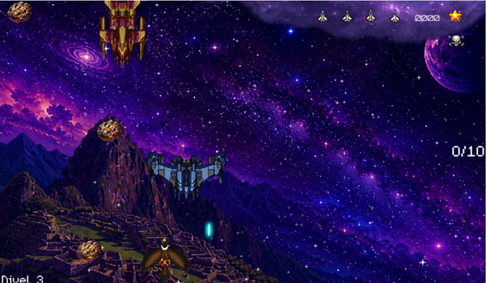
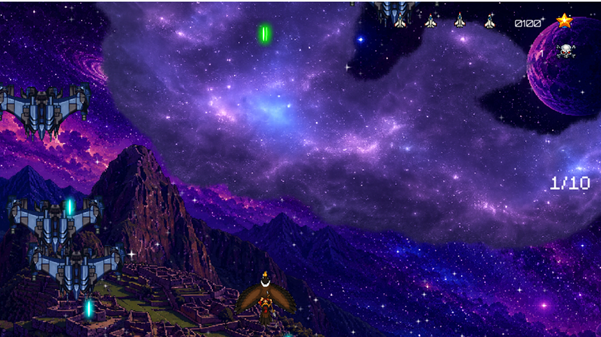
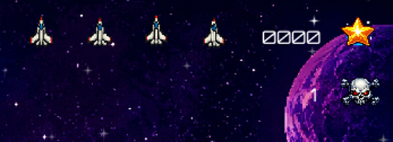
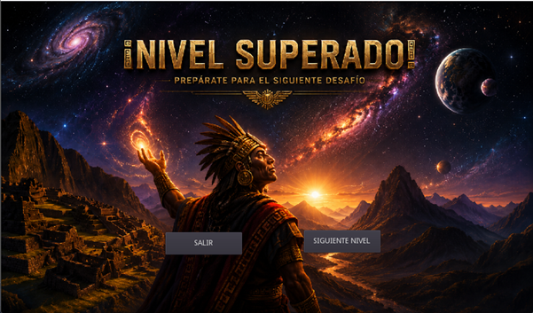
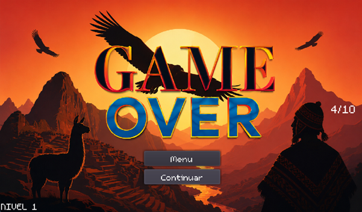
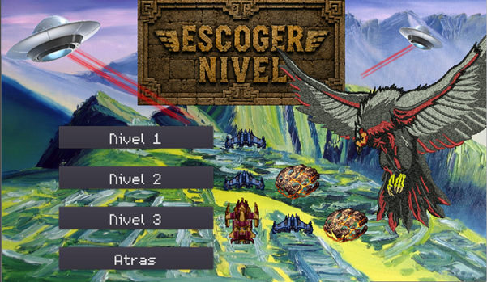
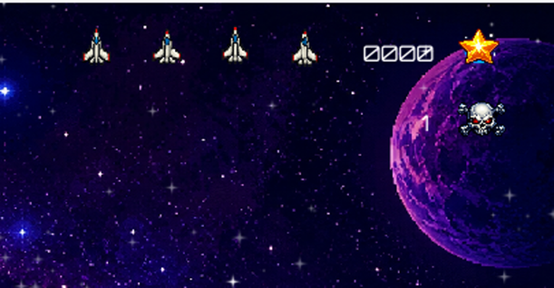

# 🚀 Defensa Cóndor / SpaceShooter

Un juego de naves estilo *space shooter* desarrollado en **Godot 3.x** (GDScript) como proyecto final de curso. Incluye mecánicas de escudo, dash, oleadas de enemigos con patrones de movimiento distintos, sistema de niveles progresivos, meteoritos y soporte para gamepad.

---

## 📋 Tabla de Contenidos

- [Visión General](#-visión-general)
- [Arquitectura del Proyecto](#-arquitectura-del-proyecto)
- [Estructura de Directorios](#-estructura-de-directorios)
- [Escenas Principales](#-escenas-principales)
- [Sistemas y Mecánicas](#-sistemas-y-mecánicas)
- [Código por Componente](#-código-por-componente)
- [Configuración del Proyecto](#-configuración-del-proyecto)
- [Controles](#-controles)
- [Audio y Assets](#-audio-y-assets)
- [Cómo Extender](#-cómo-extender)

---

## 🎮 Visión General

**Defensa Cóndor** es un *vertical shooter* donde el jugador controla una nave (el Cóndor) que debe defender el espacio de oleadas de enemigos y meteoritos. El juego presenta:

- **3 Niveles/Etapas** con dificultad creciente
- **Sistema de Escudo** regenerable (mecánica principal de supervivencia)
- **Dash/Desplazamiento rápido** para esquivar
- **2 Tipos de Enemigos** con IA distinta (ondulante y directo)
- **Meteoritos** como obstáculos ambientales
- **HUD completo**: Vidas, Escudo, Score, Nivel, Contador de enemigos
- **Game Over** con opción de reintentar o volver al menú
- **Pantalla de Victoria** con progresión a siguiente etapa
- **Soporte completo para Gamepad** (estilo Xbox)

---

## 📸 Galería

<p align="center">
  
  
  
</p>

<p align="center">
  
  
  
</p>

---

## 🏗 Arquitectura del Proyecto

### Patrón de Diseño

```
  main/Control.tscn (Menú Principal)
    ├── "Jugar"   →  stage/Stage.tscn  (Nivel 1)
    ├── "Niveles" → main/options.tscn (selección manual de nivel)
    └── "Salir"   →  exit

  Stage.tscn ──[50 enemigos]──→ DefenseCompleted.tscn
                                    └── Siguiente → Stage2.tscn
  Stage2.tscn ──[50 enemigos]──→ DefenseCompleted.tscn
                                    └── Siguiente → Stage3.tscn
  Stage3.tscn ──[50 enemigos]──→ DefenseCompleted.tscn
                                    └── Salir → Menú

  Cualquier Stage → GameOver → "INTENTAR DENUEVO" (recarga escena)
                              → "MENU" (vuelve a menú principal)
```

### Herencia de Scripts (Enemigos)

```
Enemy.gd (Base)
    │
    ├─► EnemyBlue.gd  (Movimiento ondulante/sinusoidal)
    │
    └─► EnemyRed.gd   (Movimiento vertical rápido aleatorio)
```

### Autoloads (Singleton Globales)

| Nombre | Script | Propósito |
|--------|--------|-----------|
| `Utils` | `libs/utils.gd` | Utilidades: `view_size`, `choice_list()`, acceso a nodo principal |
| `Globals` | `completed/Globals.gd` | Estado global: `current_stage` (1, 2, 3) |

---

## 📁 Estructura de Directorios

```
spaceshooter/
├── project.godot              # Configuración del proyecto
├── icon.png                   # Icono de la app
├── default_env.tres           # Environment por defecto
├── export_presets.cfg         # Presets de exportación
│
├── main/                      # Menú principal y opciones
│   ├── Control.tscn           # Escena menú principal
│   ├── Control.gd             # Lógica menú (Play, Options, Quit)
│   ├── options.tscn           # Escena opciones
│   └── options.gd             # Volver al menú
│
├── stage/                     # Escenas de juego (3 niveles)
│   ├── Stage.tscn             # Nivel 1 (sin meteoritos, solo EnemyBlue)
│   ├── Stage2.tscn            # Nivel 2 (+ meteoritos, solo EnemyBlue, música distinta)
│   ├── Stage3.tscn            # Nivel 3 (+ meteoritos, ambos enemigos, música distinta)
│   ├── Stage.gd               # Lógica principal: Score, Niveles, HUD, Game Over
│   └── MeteorSpawner.gd       # Spawner infinito de meteoritos (usado en Nv 2 y 3)
│
├── completed/                 # Pantalla de victoria
│   ├── DefenseCompleted.tscn
│   ├── DefenseCompleted.gd    # Navegación entre etapas
│   └── Globals.gd             # Autoload: current_stage
│
├── Player.tscn / Player.gd    # Jugador: movimiento, disparo, escudo, dash, gamepad
├── Bullet.gd                  # Proyectil jugador (hacia arriba)
├── Bullet/Bullet.tscn         # Escena bala
│
├── Enemy/                     # Sistema de enemigos
│   ├── Enemy.gd               # Base: vida (armor), disparo, colisiones, explosión
│   ├── Enemy.tscn
│   ├── EnemyBlue.gd / .tscn   # Movimiento sinusoidal (ola)
│   ├── EnemyRed.gd / .tscn    # Caída vertical rápida
│   ├── SpawnerEnemy.gd / .tscn# Gestor de oleadas (timer aleatorio, max 50)
│   └── effects/
│       ├── Stars.tscn         # Partículas de fondo
│       └── SpriteFall.gd      # Efecto visual caída
│
├── EnemyBullet/               # Disparos enemigos
│   ├── EnemyBullet.gd         # Hacia abajo, daña al jugador
│   └── EnemyBullet.tscn
│
├── Meteor/                    # Meteoritos
│   ├── Meteor.gd              # Caída recta, 50 pts al destruir
│   └── Meteor.tscn
│
├── sprites/                   # Efectos visuales y UI
│   ├── Explosion.gd / .tscn   # Animación de explosión (sprite sheet)
│   ├── barritas/              # Frames escudo (00-07 + All.png)
│   ├── explosiones/           # Frames explosión (4 partes x 12 frames)
│   └── orbitron/              # Fuente Orbitron
│
├── fonts/                     # Fuentes (m5x7.ttf, Orbitron)
├── img/                       # Sprites nave, enemigos, fondos
├── libs/
│   └── utils.gd               # Utilidades globales
├── Music/                     # Música por nivel (.wav, .mp3)
├── sounds/                    # SFX (disparo, daño, escudo, explosión)
└── orbitron/                  # Fuente variable Orbitron
```

---

## 🎬 Escenas Principales

### 1. Menú Principal (`main/Control.tscn`)
- **Botones**: "Jugar" → `Stage.tscn`, "Niveles" → `options.tscn`, "Salir" → `quit()`
- Fondo con imagen estática (`machupicchugreen.jpg`) + sprites decorativos de cóndores
- Música de menú: `life_goes_on.wav` (autoplay)

### 2. Nivel 1 (`stage/Stage.tscn`)
**Nodos principales:**
```
Stage (Node + Stage.gd)
├── Stars (Stars.tscn)          # Fondo estrellado
├── Player (Player.tscn)        # Nave jugador
├── PlayerPosition (Position2D) # Spawn inicial
├── SpawnerEnemy (SpawnerEnemy.tscn) # Spawner enemigos (solo EnemyBlue)
└── CanvasLayer (HUD)
    ├── life1-4 (Sprite)        # Iconos de vida
    ├── ScoreIcon + ScoreLabel  # Puntuación (4 dígitos)
    ├── LevelIcon + LevelLabel  # Nivel actual
    ├── EnemyCounter            # "destruidos/total"
    ├── ShieldBar (Sprite)      # Barra escudo 5 frames
    ├── ShieldBreakIcon         # Icono "escudo roto"
    ├── DamageOverlay           # Animación daño (sprite sheet)
    ├── GameOver (Control)      # Pantalla Game Over
    │   ├── ColorRect (overlay rojo)
    │   ├── Sprite (fondo Perú)
    │   └── VBoxContainer
    │       ├── "MENU" Button
    │       └── "INTENTAR DENUEVO" Button
    └── SALIR Button            # Botón salir en juego
```

### 3. Nivel 2 (`stage/Stage2.tscn`)
- Añade `MeteorSpawner` (meteoritos cada 1s)
- `spawn_red = false` (solo EnemyBlue, igual que Nivel 1)
- Música `Ananau.wav`, pitch 1.75x
- Texto "Nivel 2" en HUD

### 4. Nivel 3 (`stage/Stage3.tscn`)
- También tiene `MeteorSpawner`
- **Ambos tipos de enemigo activos** (EnemyBlue + EnemyRed)
- Música `music_3_triciclo.wav`, pitch 1.25x
- Texto "Nivel 3" en HUD

### 5. Victoria (`completed/DefenseCompleted.tscn`)
- Botón "SALIR" → Menú principal
- Botón "SIGUIENTE" → Avanza `Globals.current_stage` y carga Stage2/Stage3

---

## ⚙️ Sistemas y Mecánicas

### 1. Sistema de Escudo (Core Mechanic)
**Ubicación**: `Player.gd` líneas 21-33, 91-111, 219-232

```gdscript
var max_shield = 100.0
var shield = 100.0
var shield_recharge_time = 10.0    # Segundos para recarga completa
var shield_recharging = false
var shield_recharge_progress = 0.0
```

**Lógica**:
- Escudo **siempre lleno al inicio** (100)
- Al recibir daño **con escudo al 100% y sin recargar**: se rompe instantáneamente (`shield = 0`), inicia recarga de 10s → **NO pierde vida**
- Durante la recarga el jugador **NO tiene protección** — cualquier golpe resta una vida
- Tras 10s: `shield = 100`, sonido de recarga, `shield_recharging = false` (vuelve a proteger)
- **Visual**: `ShieldBar` (Sprite con 5 hframes) muestra el progreso de recarga visualmente

### 2. Sistema de Vidas
- **4 vidas** iniciales (iconos `life1`–`life4` en HUD)
- Pierde vida si: **sin escudo** O **escudo recargándose** al recibir golpe
- 0 vidas → `game_over()` → pausa juego + muestra panel GameOver

### 3. Dash / Desplazamiento Rápido
```gdscript
var dash_speed = 900      # px/s (vs 600 normal)
var dash_time = 0.15      # segundos
var is_dashing = false
```
- Teclado: **Shift Izquierdo** (`dash`)
- Gamepad: **LB (4)** o **A (0)** (`controller_dash`)
- Durante dash: velocidad 900 px/s y nave se tiñe cyan (`Color(0.5, 0.8, 1)`)

### 4. Disparo
- **Doble cañón**: instancia 2 balas (`LeftCannon`, `RightCannon`)
- Cooldown controlado por `ShootTimer` (autoload no, es nodo en Player.tscn)
- Teclado: **Espacio** (`shoot`)
- Gamepad: **RB (5)** / **Trigger derecho (>0.5)** (`controller_shoot`)

### 5. Niveles / Dificultad Progresiva

<p align="center"></p>

**En `Stage.gd`**:
```gdscript
func check_level():
    if score >= 3000: level = 3
    elif score >= 1000: level = 2
    else: level = 1
    apply_level()

func apply_level():
    match level:
        1: SpawnTimer.wait_time = 2.0
        2: SpawnTimer.wait_time = 1.2
        3: SpawnTimer.wait_time = 0.6
```
- Cada nivel **reduce el intervalo de spawn** progresivamente
- Al destruir **50 enemigos** → Victoria → `DefenseCompleted.tscn`

### 6. Puntuación

<p align="center"></p>

| Objetivo | Puntos |
|----------|--------|
| Enemigo (EnemyBlue/Red) | 100 |
| Meteorito | 50 |

### 7. Gamepad Support (Xbox Layout)
| Acción | Teclado | Gamepad | InputMap |
|--------|---------|---------|----------|
| Disparar | Espacio | RB (5) / Trigger derecho | `shoot` / `controller_shoot` |
| Dash | Shift Izq | LB (4) / A (0) | `dash` / `controller_dash` |
| Pausa | Escape | Start (11) | `pause` / `controller_pause` |
| Movimiento | Flechas direccionales | Stick derecho (ejes 2,3) | `ui_up/down/left/right` |

**Configuración automática en `_ready()`** (`Player.gd:54-75`):
```gdscript
if not InputMap.has_action("controller_shoot"):
    # Crea actions y asigna botones de gamepad
```

### 8. Animación de Daño
- **Sprite sheet** 6 frames (`damage_frames` array de Rect2)
- Se reproduce en `DamageOverlay` (Sprite con region_rect)
- Duración: 0.1s por frame → 600ms total

---

## 💻 Código por Componente

### `Player.gd` (286 líneas) — Nave del Jugador
```gdscript
extends Area2D

# ── Exportados ──────────────────────────────
export var speed = 600
export (PackedScene) var Bullet

# ── Referencias UI (onready) ────────────────
onready var sprite = $Sprite
onready var life1 = $"../CanvasLayer/life1"  # ... life4
onready var shield_bar = $"../CanvasLayer/ShieldBar"
onready var shield_break_icon = $"ShieldBreakIcon"
onready var damage_overlay = $"DamageOverlay"

# ── Estado ──────────────────────────────────
var screen_size
var can_shoot = true
var lives = 4

# Escudo
var max_shield = 100.0
var shield = 100.0
var shield_recharge_time = 10.0
var shield_recharging = false
var shield_recharge_progress = 0.0
var shield_break_timer = 0.0

# Daño visual
var damage_anim_playing = false
var damage_anim_frame = 0
var damage_anim_timer = 0.0
var damage_frames = [Rect2(1,0,15,29), Rect2(22,0,27,29), ...]

# Dash
var dash_speed = 900
var dash_time = 0.15
var is_dashing = false
var dash_timer = 0.0
```

**Métodos clave**:
| Método | Descripción |
|--------|-------------|
| `_ready()` | Inicializa viewport, vidas, escudo, gamepad |
| `_physics_process(delta)` | Movimiento, dash, disparo, pausa, actualiza escudo/animaciones |
| `shoot()` | Instancia 2 balas en posiciones de cañones |
| `damage()` | Lógica escudo/vidas, game over |
| `_on_Player_area_entered(area)` | Colisiones: meteor, enemy_bullet, enemy |
| `_update_shield_recharge(delta)` | Recarga progresiva del escudo |
| `_update_shield_bar()` | Actualiza frame del sprite ShieldBar (5 frames) |
| `_play_damage_anim()` / `_update_damage_anim(delta)` | Animación sprite sheet daño |
| `_on_ShootTimer_timeout()` | Resetea `can_shoot = true` (cooldown de disparo) |

---

### `Bullet.gd` (9 líneas) — Proyectil Jugador
```gdscript
extends Area2D
export var speed = 600

func _process(delta):
    position.y -= speed * delta  # Hacia arriba

func _on_VisibilityNotifier2D_screen_exited():
    queue_free()  # Limpieza al salir de pantalla
```
- Grupo: `"bullet"` (para detección en Enemy/Meteor)

---

### `Enemy.gd` (97 líneas) — Enemigo Base
```gdscript
extends Area2D
export (PackedScene) var EnemyBullet
export var velocity = Vector2(0, 100)
export var armor = 4  # 4 impactos para destruir
var can_move = true
```

**Flujo de daño** (`_on_Enemy_area_entered`):
1. **Bala jugador** (`area.is_in_group("bullet")`): `armor -= 1`, destruye bala, sonido hit
2. **Jugador** (`area.is_in_group("player")`): `armor = 0` (muerte instantánea al chocar)
3. **Muerte** (`armor <= 0`):
   - `get_parent().add_score(100)` si parent tiene método
   - Spawnea `Explosion.tscn` en posición
   - Suena explosión, desactiva collision, hide, espera animación, `queue_free()`

**Disparo** (`_on_ShootTimer_timeout`):
- Instancia `EnemyBullet` en `ShootPoint` (o posición actual)
- Añade a parent (Stage)
- Suena `laserEnemy`

---

### `EnemyBlue.gd` (40 líneas) — Movimiento Ondulante
```gdscript
extends "res://Enemy/Enemy.gd"

export var wave_height = 120
export var wave_speed = 2
export var horizontal_speed = 120

var time = 0
var start_y
var offset = 0

func _ready():
    randomize()
    offset = rand_range(0, 10)
    velocity.x = Utils.choice_list([horizontal_speed, -horizontal_speed])
    start_y = position.y + 200

func _physics_process(delta):
    time += delta
    position.x += velocity.x * delta
    position.y = start_y + sin((time + offset) * wave_speed) * wave_height
    rotation = sin(time * 3 + offset) * 0.1  # Leve rotación visual

    # Rebote en bordes (64px margen)
    if position.x <= 64: velocity.x = abs(velocity.x)
    if position.x >= Utils.view_size.x - 64: velocity.x = -abs(velocity.x)
```

---

### `EnemyRed.gd` (8 líneas) — Caída Vertical Rápida
```gdscript
extends "res://Enemy/Enemy.gd"

func _ready():
    randomize()
    velocity = Vector2(0, rand_range(250, 1000))  # Velocidad aleatoria 250-1000
```

---

### `SpawnerEnemy.gd` (54 líneas) — Gestor de Oleadas
```gdscript
extends Node

export(bool) var spawn_blue = true
export(bool) var spawn_red = true
export(int) var max_enemies = 50

var enemies_spawned = 0
const BLUE = preload("res://Enemy/EnemyBlue.tscn")
const RED = preload("res://Enemy/EnemyRed.tscn")
var enemies = []

func _ready():
    randomize()
    if spawn_blue: enemies.append(BLUE)
    if spawn_red: enemies.append(RED)
    $SpawnTimer.start()

func spawn():
    if enemies_spawned >= max_enemies: $SpawnTimer.stop(); return
    if enemies.empty(): return
    
    var enemy = Utils.choice_list(enemies).instance()
    enemy.position = Vector2(rand_range(64, Utils.view_size.x - 64), -64)
    get_parent().add_child(enemy)
    enemies_spawned += 1
    $SpawnTimer.wait_time = rand_range(0.5, 2.0)  # Overrideado por Stage.apply_level()
    $SpawnTimer.start()

func _on_SpawnerTimer_timeout(): spawn()
```
- **Stage 2**: `spawn_red = false` (solo azules)
- **Stage 1/3**: Ambos activos
- Timer base aleatorio 0.5-2s, **luego Stage.gd lo sobrescribe** según nivel

---

### `Meteor.gd` (21 líneas) — Meteoritos
```gdscript
extends Area2D
export var speed = 250

func _physics_process(delta):
    position.y += speed * delta
    if position.y > Utils.view_size.y + 50: queue_free()

func _on_Meteor_area_entered(area):
    if area.is_in_group("bullet"):
        area.queue_free()
        if get_parent().has_method("add_score"):
            get_parent().add_score(50)
        _spawn_explosion()
        queue_free()
```
- Grupo: `"meteor"` (detectado por Player)
- 50 pts al destruir

---

### `MeteorSpawner.gd` (14 líneas) — Spawner Infinito
```gdscript
extends Node
export (PackedScene) var Meteor

func _ready():
    while true:
        spawn()
        yield(get_tree().create_timer(1.0), "timeout")

func spawn():
    var m = Meteor.instance()
    get_parent().add_child(m)
    m.position = Vector2(rand_range(0, 1024), -50)
```
- Spawnea **cada 1 segundo** indefinidamente
- Posición X aleatoria (0-1024), Y = -50 (fuera de pantalla)

---

### `EnemyBullet.gd` (15 líneas) — Disparo Enemigo
```gdscript
extends Area2D
export var speed = 400

func _physics_process(delta):
    position.y += speed * delta  # Hacia abajo

func _on_EnemyBullet_area_entered(area):
    if area.is_in_group("player"):
        area.damage()  # Llama a Player.damage()
        queue_free()

func _on_VisibilityNotifier2D_screen_exited():
    queue_free()
```

---

### `Stage.gd` (115 líneas) — Controlador de Nivel
```gdscript
extends Node

# Estado
var score = 0
var level = 1
var enemies_destroyed = 0
var enemies_total = 50

# HUD (onready)
onready var score_label = $CanvasLayer/ScoreLabel
onready var level_label = $CanvasLayer/LevelLabel
onready var enemy_counter = $CanvasLayer/EnemyCounter

func _ready():
    $Player.position = $PlayerPosition.global_position
    $CanvasLayer/GameOver.visible = false
    update_ui()
    update_enemy_counter()

func add_score(points):
    score += points
    enemies_destroyed += 1
    check_level()
    update_ui()
    update_enemy_counter()
    if enemies_destroyed >= enemies_total:
        get_tree().change_scene("res://completed/DefenseCompleted.tscn")

func check_level():
    if score >= 3000: level = 3
    elif score >= 1000: level = 2
    else: level = 1
    apply_level()

func apply_level():
    match level:
        1: $SpawnerEnemy/SpawnTimer.wait_time = 2.0
        2: $SpawnerEnemy/SpawnTimer.wait_time = 1.2
        3: $SpawnerEnemy/SpawnTimer.wait_time = 0.6

func game_over():
    $CanvasLayer/GameOver.visible = true
    $SoungGameOver.play()
    get_tree().paused = true
```

**Botones GameOver**:
- `_on_Salir_menu_pressed()` / `_on_Salir_pressed()` / `_on_SALIR_pressed()` → Menú principal
- `_on_continuar_pressed()` → `get_tree().reload_current_scene()` (reintentar)

<p align="center"></p>

---

### `DefenseCompleted.gd` (23 líneas) — Pantalla Victoria
```gdscript
extends Control

func _on_Salir_pressed():
    get_tree().change_scene("res://main/Control.tscn")

func _on_Siguiente_pressed():
    if Globals.current_stage == 1:
        Globals.current_stage = 2
        get_tree().change_scene("res://stage/Stage2.tscn")
    elif Globals.current_stage == 2:
        Globals.current_stage = 3
        get_tree().change_scene("res://stage/Stage3.tscn")
```

---

### `Globals.gd` (Autoload) — Estado Global
```gdscript
extends Node
var current_stage = 1  # 1, 2, 3
```

---

### `utils.gd` (Autoload) — Utilidades
```gdscript
extends Node

var main_node setget , _get_main_node
var view_size setget , _get_view_size

func _get_main_node():
    var root = get_tree().get_root()
    return root.get_child(root.get_child_count() - 1)

func _get_view_size():
    return get_tree().get_root().get_visible_rect().size

func choice_list(list):
    randomize()
    var random_index = randi() % list.size()
    return list[random_index]
```
- `Utils.view_size` → `Vector2` del viewport (usado en EnemyBlue, SpawnerEnemy, MeteorSpawner)
- `Utils.choice_list(array)` → Elemento aleatorio de array

---

### `Explosion.gd` — Efecto Explosión
- Sprite con `region_rect` animado manualmente (20 frames de 128×128)
- Sprite sheet en `sprites/explosiones/part_1` a `part_4` (48 frames totales, 12 c/u)

---

### `SpriteFall.gd` — Partículas Caída
- Efecto visual estrellas/partículas en fondo (`Stars.tscn`)

---

## ⚙️ Configuración del Proyecto (`project.godot`)

```ini
[application]
config/name="spaceshooterC"
run/main_scene="res://main/Control.tscn"
config/icon="res://icon.png"

[autoload]
Utils="*res://libs/utils.gd"
Globals="*res://completed/Globals.gd"

[display]
window/handheld/orientation="portrait"
window/stretch/mode="2d"
window/stretch/aspect="keep"

[input]
shoot = { key: SPACE }
pause = { key: ESCAPE }
dash = { key: SHIFT_LEFT }
# Gamepad actions creados dinámicamente en Player._ready()

[rendering]
environment/default_clear_color=Color(0.3, 0.3, 0.3, 1)
```

---

## 🎵 Audio y Assets

### Música por Escena
| Escena | Archivo | Volumen | Pitch |
|--------|---------|---------|-------|
| Stage 1 | `flute_battle.wav` | -4 dB | 1.0 |
| Stage 2 | `Ananau.wav` | -4 dB | 1.75 |
| Stage 3 | `music_3_triciclo.wav` | +2 dB | 1.25 |
| Menú | `life_goes_on.wav` | (por defecto) | 1.0 |

### SFX Principales
| Sonido | Uso |
|--------|-----|
| `SonidoLanza` | Disparo jugador |
| `SonidoDano` | Daño a jugador (sin escudo) |
| `SonidoEscudoRoto` | Escudo se rompe |
| `SonidoEscudoRecarga` | Escudo recargado al 100% |
| `laserEnemy` / `laser_fire` | Disparo enemigo |
| `explotion` | Explosión enemigo/meteorito |
| `game_over_sound` | Game Over |
| `escudo-recarga/roto`, `hit_enemy/ship`, `laser_enemy/ship`, `powerup` | Varios |

### Sprites Clave
- **Jugador**: `img/nave_player.png`, `img/condor*.png`
- **Enemigos**: `sprites/enemy_1/2/3.png`, `img/condor*.png`
- **Escudo**: `sprites/barritas/00.png`–`07.png` + `All.png` (5 frames HFrames)
- **Explosión**: `sprites/explosiones/part_1-4/` (12 frames c/u)
- **Fondos**: `main/fondo_peru.png`, `Enemy/effects/fondo_espacio.png`, `nebulosa.png`
- **UI**: `sprites/life.png`, `sprites/score.png`, `sprites/level.png`, `sprites/GameOver.png`

---

## 🔧 Cómo Extender

### Añadir Nuevo Tipo de Enemigo
1. Crear `EnemyNuevo.gd` extendiendo `Enemy.gd`
2. Implementar `_physics_process()` con movimiento único
3. Crear `.tscn` con `CollisionShape2D`, `AnimatedSprite`, `ShootPoint`, `ShootTimer`, `VisibilityNotifier2D`, `AudioStreamPlayer` (laserEnemy, explotion)
4. Añadir a `SpawnerEnemy.tscn` en export `enemies` array o en `_ready()` de `SpawnerEnemy.gd`

### Añadir Power-up
1. Crear `PowerUp.gd` extendiendo `Area2D`
2. En `_on_area_entered` detectar `"player"` → aplicar efecto
3. Spawnear desde `Stage.gd` o nuevo `PowerUpSpawner`
4. Efectos ideas: `shield += 25`, `speed *= 1.5` temporal, `can_shoot = true` (reset cooldown), vida extra

### Nuevo Nivel (Stage 4)
1. Duplicar `Stage3.tscn` → `Stage4.tscn`
2. Cambiar música, fondo, texto "Nivel 4"
3. En `Stage.gd` → `check_level()` añadir `elif score >= 6000: level = 4`
4. En `apply_level()` añadir case 4 con `wait_time = 0.3`
5. En `DefenseCompleted.gd` añadir case para `current_stage == 3` → `Stage4.tscn`
6. Actualizar `Globals.current_stage` max

### Cambiar Resolución / Aspect Ratio
- `project.godot`: `window/stretch/mode="2d"`, `aspect="keep"`
- Viewport base: 1024×? (ver `Utils.view_size`)
- Sprites UI usan anclajes (anchors) en CanvasLayer

---

## 🐛 Known Issues / Mejoras Pendientes

1. **Archivos .wav grandes** (80MB+) en Music/ — convertir a .ogg para distribución
2. `MeteorSpawner.gd` usa `while true` con `yield` — considerar `Timer` para mejor control
3. `randomize()` llamado múltiples veces en `_ready()` de varios scripts — una vez al inicio basta
4. `Enemy.gd` variable `area` en `_on_Enemy_area_entered` representa la bala, pero el nombre es genérico
5. Falta pantalla de "Pausa" dedicada (solo `get_tree().paused = true`)
6. `EnemyBlue` rotación visual no afecta hitbox (CollisionShape2D no rota con sprite)
7. `SpawnerEnemy` `max_enemies = 50` hardcoded — podría ser por nivel
8. `EnemyCounter` label muestra "0/10" por defecto pero `enemies_total = 50` en Stage.gd — el label se actualiza correctamente al destruir enemigos, pero el texto default no coincide
9. `Bullet.gd` usa `_process()` mientras que otros scripts usan `_physics_process()` — inconsistencia en el loop
10. No hay guardado de high-score / progreso entre sesiones
11. Stage 1 no tiene `MeteorSpawner` a diferencia de Stage 2 y 3 — intencional, pero no documentado en juego

---

## 📄 Licencia

Proyecto educativo — Curso de Desarrollo de Videojuegos con Godot.
Assets de audio/imagen: verificar licencias individuales antes de uso comercial.

---

## 👨‍💻 Autores
 
**Nicolás Huarcaya Chipana** 
**Mario Manuel Antizana Ponce de Leon** 
GitHub: [@MarioAntizana1](https://github.com/MarioAntizana1)  
Repositorio: [proyecto-naves-godot](https://github.com/MarioAntizana1/proyecto-naves-godot)
